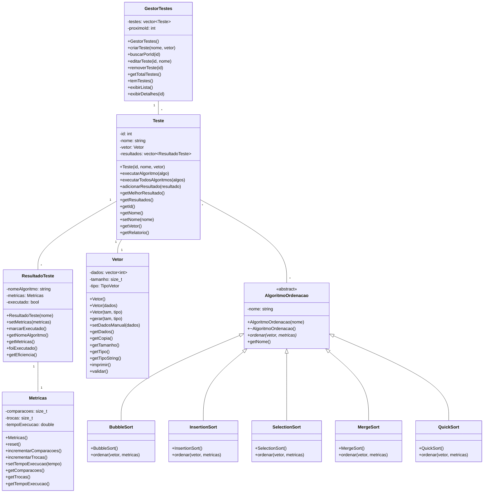

# Diagrama UML - Sistema de Algoritmos de Ordenação

## Código para Mermaid Chart

Copie e cole este código no site [mermaid.live](https://mermaid.live) para gerar o diagrama:



## Código para Copiar e Colar

```
classDiagram
direction TB
    class AlgoritmoOrdenacao {
        <<abstract>>
        -nome: string
        +AlgoritmoOrdenacao(nome)
        +~AlgoritmoOrdenacao()
        +ordenar(vetor, metricas)*
        +getNome()
    }

    class BubbleSort {
        +BubbleSort()
        +ordenar(vetor, metricas)
    }

    class InsertionSort {
        +InsertionSort()
        +ordenar(vetor, metricas)
    }

    class SelectionSort {
        +SelectionSort()
        +ordenar(vetor, metricas)
    }

    class MergeSort {
        +MergeSort()
        +ordenar(vetor, metricas)
    }

    class QuickSort {
        +QuickSort()
        +ordenar(vetor, metricas)
    }

    class Vetor {
        -dados: vector~int~
        -tamanho: size_t
        -tipo: TipoVetor
        +Vetor()
        +Vetor(dados)
        +Vetor(tam, tipo)
        +gerar(tam, tipo)
        +setDadosManual(dados)
        +getDados()
        +getCopia()
        +getTamanho()
        +getTipo()
        +getTipoString()
        +imprimir()
        +validar()
    }

    class Metricas {
        -comparacoes: size_t
        -trocas: size_t
        -tempoExecucao: double
        +Metricas()
        +reset()
        +incrementarComparacoes()
        +incrementarTrocas()
        +setTempoExecucao(tempo)
        +getComparacoes()
        +getTrocas()
        +getTempoExecucao()
    }

    class ResultadoTeste {
        -nomeAlgoritmo: string
        -metricas: Metricas
        -executado: bool
        +ResultadoTeste(nome)
        +setMetricas(metricas)
        +marcarExecutado()
        +getNomeAlgoritmo()
        +getMetricas()
        +foiExecutado()
        +getEficiencia()
    }

    class Teste {
        -id: int
        -nome: string
        -vetor: Vetor
        -resultados: vector~ResultadoTeste~
        +Teste(id, nome, vetor)
        +executarAlgoritmo(algo)
        +executarTodosAlgoritmos(algos)
        +adicionarResultado(resultado)
        +getMelhorResultado()
        +getResultados()
        +getId()
        +getNome()
        +setNome(nome)
        +getVetor()
        +getRelatorio()
    }

    class GestorTestes {
        -testes: vector~Teste~
        -proximoId: int
        +GestorTestes()
        +criarTeste(nome, vetor)
        +buscarPorId(id)
        +editarTeste(id, nome)
        +removerTeste(id)
        +getTotalTestes()
        +temTestes()
        +exibirLista()
        +exibirDetalhes(id)
    }

    AlgoritmoOrdenacao <|-- BubbleSort
    AlgoritmoOrdenacao <|-- InsertionSort
    AlgoritmoOrdenacao <|-- SelectionSort
    AlgoritmoOrdenacao <|-- MergeSort
    AlgoritmoOrdenacao <|-- QuickSort

    Teste "1" -- "1" Vetor
    ResultadoTeste "1" -- "1" Metricas
    Teste "1" -- "*" ResultadoTeste
    GestorTestes "1" -- "*" Teste
    Teste "*" -- "*" AlgoritmoOrdenacao
```

### 📊 **Classes Implementadas (8+ classes)** ✅
1. `AlgoritmoOrdenacao` (classe abstrata)
2. `BubbleSort`
3. `InsertionSort` 
4. `SelectionSort`
5. `MergeSort`
6. `QuickSort`
7. `Vetor`
8. `Metricas`
9. `ResultadoTeste`
10. `Teste`
11. `GestorTestes`

### 🔗 **Relacionamentos Obrigatórios** ✅

#### **1:1 (Um para Um)**
- `Teste "1" -- "1" Vetor` - Cada teste tem **exatamente 1** vetor
- `ResultadoTeste "1" -- "1" Metricas` - Cada resultado tem **exatamente 1** métrica

#### **1:N (Um para Muitos)**
- `Teste "1" -- "*" ResultadoTeste` - Um teste tem **muitos** resultados
- `GestorTestes "1" -- "*" Teste` - Um gestor gerencia **muitos** testes

#### **N:M (Muitos para Muitos)**
- `Teste "*" -- "*" AlgoritmoOrdenacao` - Muitos testes podem usar muitos algoritmos

### 🏗️ **Conceitos de POO** ✅

#### **Encapsulamento**
- Atributos privados (-): `dados`, `comparacoes`, `trocas`, etc.
- Métodos públicos (+): `getDados()`, `getComparacoes()`, etc.

#### **Herança**
- `AlgoritmoOrdenacao <|-- BubbleSort` (e outros algoritmos)
- Classe pai abstrata com método virtual puro

#### **Polimorfismo**
- Método `ordenar()` implementado diferentemente em cada algoritmo
- Interface uniforme para todos os algoritmos

### 💾 **CRUD Implementado** ✅
- **Create**: `criarTeste()`
- **Read**: `listarTestes()`, `buscarPorId()`
- **Update**: `editarTeste()`
- **Delete**: `removerTeste()`

### 🎯 **Legenda dos Relacionamentos:**
- `"1" -- "1"` = **1:1** (um para um)
- `"1" -- "*"` = **1:N** (um para muitos)
- `"*" -- "*"` = **N:M** (muitos para muitos)
- `<|--` = **Herança** (é um)

### 🎯 **Como Usar:**
1. Vá para [mermaid.live](https://mermaid.live)
2. Cole o código acima
3. O diagrama será gerado automaticamente
4. Clique em "Export" para salvar como imagem


---

*Desenvolvido por: Fernanda Nascimento*
